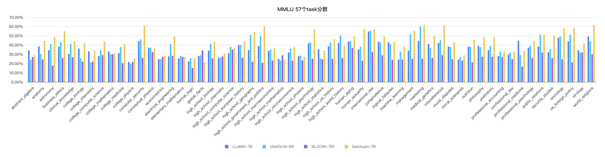
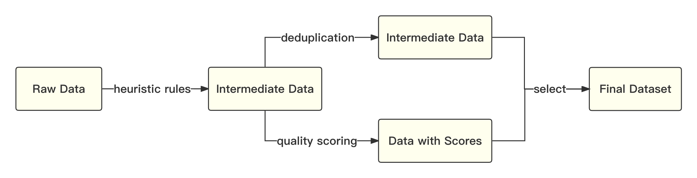
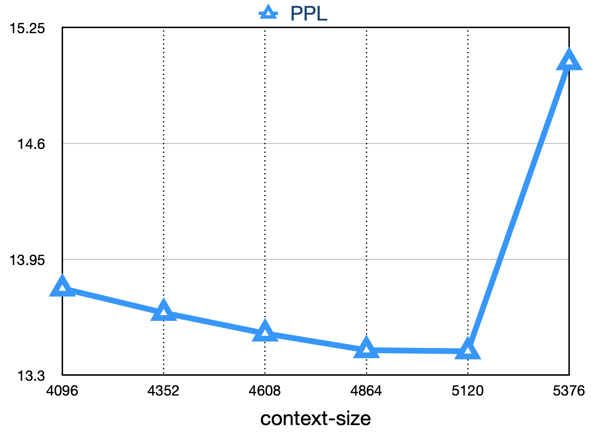
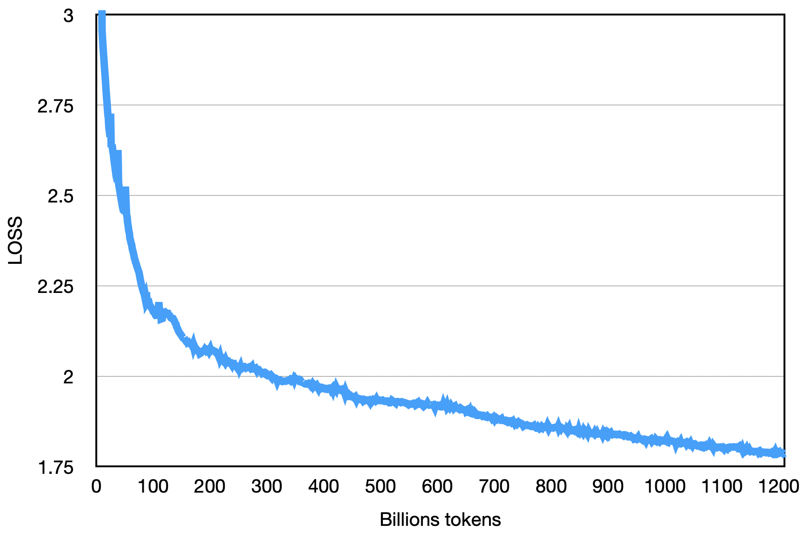

<div align="center">
      <h1> baichuan-7B </h1>
<p align="center" style="display: flex; flex-direction: row; justify-content: center; align-items: center">
      🤗 
      <a href="https://huggingface.co/baichuan-inc/baichuan-7B" target="_blank" style="margin-right: 15px; margin-left: 10px">Hugging Face</a> • 
        🤖
      <a href="https://modelscope.cn/organization/baichuan-inc" target="_blank" style="margin-left: 10px">ModelScope</a > •
        <a href="https://github.com/baichuan-inc/baichuan-7B/blob/main/media/wechat.jpeg?raw=true" target="_blank" rel="noopener noreferrer" style="display: inline-block; margin-left: 10px">
      <span style="color: blue;">Wechat</span>
    </a>
    </p>


[](https://github.com/baichuan-inc/baichuan-7B/blob/main/LICENSE)
<h4 align="center">
    <p>
        <b>中文</b> |
        <a href="https://github.com/baichuan-inc/baichuan-7B/blob/main/README_EN.md">English</a>
    <p>
</h4>


</div>

# 介绍

baichuan-7B 是由百川智能开发的一个开源可商用的大规模预训练语言模型。基于 Transformer 结构，在大约 1.2 万亿 tokens 上训练的 70 亿参数模型，支持中英双语，上下文窗口长度为 4096。在标准的中文和英文权威 benchmark（C-EVAL/MMLU）上均取得同尺寸最好的效果。

# 公开benchmark榜单

## 中文评测
### C-Eval
[C-Eval 数据集](https://cevalbenchmark.com/index.html)是一个全面的中文基础模型评测数据集，涵盖了 52 个学科和四个难度的级别。我们使用该数据集的 dev 集作为 few-shot 的来源，在 test 集上进行了 5-shot 测试。

先修改 `evaluate_zh.py` 中的 OPENMODEL_PATH 和 CEVAL_DATA_PATH 两个值，分别是模型存放的路径和 C-Eval 数据集的路径，再执行下面的脚本：

```shell
shot=5  # few-shot
gpu=0  # 显卡id
split=test  # 评估测试集
model_id=baichuan-7b   # 待评估的模型
task=ceval  # 任务名称：ceval
echo gpu_idx-${gpu}-${model_id}_${task}_${split}_${shot}-shot
nohup python  evaluate_zh.py --gpu_idx ${gpu} --model_id ${model_id} --task ${task} --shot ${shot} --split ${split} --show_detail  > ${model_id}_${task}_${split}_${shot}-shot_record.txt 2>&1 &
```

### 结果

| Model 5-shot                | Average | Avg(Hard) | STEM | Social Sciences | Humanities | Others |
|-----------------------------|---------|-----------|------|-----------------|------------|--------|
| GPT-4                       | 68.7    | 54.9      | 67.1 | 77.6            | 64.5       | 67.8   |
| ChatGPT                     | 54.4    | 41.4      | 52.9 | 61.8            | 50.9       | 53.6   |
| Claude-v1.3                 | 54.2    | 39.0      | 51.9 | 61.7            | 52.1       | 53.7   |
| Claude-instant-v1.0         | 45.9    | 35.5      | 43.1 | 53.8            | 44.2       | 45.4   |
| BLOOMZ-7B                   | 35.7    | 25.8      | 31.3 | 43.5            | 36.6       | 35.6   |
| ChatGLM-6B                  | 34.5    | 23.1      | 30.4 | 39.6            | 37.4       | 34.5   |
| Ziya-LLaMA-13B-pretrain     | 30.2    | 22.7      | 27.7 | 34.4            | 32.0       | 28.9   |
| moss-moon-003-base (16B)    | 27.4    | 24.5      | 27.0 | 29.1            | 27.2       | 26.9   |
| LLaMA-7B-hf                 | 27.1    | 25.9      | 27.1 | 26.8            | 27.9       | 26.3   |
| Falcon-7B                   | 25.8    | 24.3      | 25.8 | 26.0            | 25.8       | 25.6   |
| TigerBot-7B-base            | 25.7    | 27.0      | 27.3 | 24.7            | 23.4       | 26.1   |
| Aquila-7B<sup>*</sup>       | 25.5    | 25.2      | 25.6 | 24.6            | 25.2       | 26.6   |
| Open-LLaMA-v2-pretrain (7B) | 24.0    | 22.5      | 23.1 | 25.3            | 25.2       | 23.2   |
| BLOOM-7B                    | 22.8    | 20.2      | 21.8 | 23.3            | 23.9       | 23.3   |
| **baichuan-7B**             | 42.8    | 31.5      | 38.2 | 52.0            | 46.2       | 39.3   |


### Gaokao
[Gaokao](https://github.com/OpenLMLab/GAOKAO-Bench) 是一个以中国高考题作为评测大语言模型能力的数据集，用以评估模型的语言能力和逻辑推理能力。
我们只保留了其中的单项选择题，随机划分后对所有模型进行统一 5-shot 测试。

### 结果
以下是测试的结果。

| Model            | Average |
|-------------------------|-----------------|
| BLOOMZ-7B               | 28.72           |
| LLaMA-7B                | 27.81           |
| BLOOM-7B                | 26.96           |
| TigerBot-7B-base        | 25.94           |
| Falcon-7B               | 23.98           |
| Ziya-LLaMA-13B-pretrain | 23.17           |
| ChatGLM-6B              | 21.41           |
| Open-LLaMA-v2-pretrain  | 21.41           |
| Aquila-7B<sup>*</sup>   | 24.39           |
| **baichuan-7B**         | **36.24**       |


### AGIEval
[AGIEval](https://github.com/microsoft/AGIEval) 旨在评估模型的认知和解决问题相关的任务中的一般能力。
我们只保留了其中的四选一单项选择题，随机划分后对所有模型进行了统一 5-shot 测试。

### 结果

| Model            | Average |
|-------------------------|-----------------|
| BLOOMZ-7B               | 30.27           |
| LLaMA-7B                | 28.17           |
| Ziya-LLaMA-13B-pretrain | 27.64           |
| Falcon-7B               | 27.18           |
| BLOOM-7B                | 26.55           |
| Aquila-7B<sup>*</sup>   | 25.58           |
| TigerBot-7B-base        | 25.19           |
| ChatGLM-6B              | 23.49           |
| Open-LLaMA-v2-pretrain  | 23.49           |
| **baichuan-7B**         | **34.44**       |

<sup>*</sup>其中 Aquila 模型来源于智源官方网站(https://model.baai.ac.cn/model-detail/100098) 仅做参考

## 英文榜单
除了中文之外，我们也测试了模型在英文上的效果，[MMLU](https://arxiv.org/abs/2009.03300) 是包含 57 个多选任务的英文评测数据集，涵盖了初等数学、美国历史、计算机科学、法律等，难度覆盖高中水平到专家水平，是目前主流的LLM评测数据集。

我们采用了[开源](https://github.com/hendrycks/test) 的评测方案，最终 5-shot 结果如下所示：

### 结果

| Model                                  | Humanities | Social Sciences | STEM | Other | Average |
|----------------------------------------|-----------:|:---------------:|:----:|:-----:|:-------:|
| ChatGLM-6B<sup>0</sup>                 |       35.4 |      41.0       | 31.3 | 40.5  |  36.9   |
| BLOOMZ-7B<sup>0</sup>                  |       31.3 |      42.1       | 34.4 | 39.0  |  36.1   |
| mpt-7B<sup>1</sup>                     |          - |        -        |  -   |   -   |  35.6   |
| LLaMA-7B<sup>2</sup>                   |       34.0 |      38.3       | 30.5 | 38.1  |  35.1   |
| Falcon-7B<sup>1</sup>                  |          - |        -        |  -   |   -   |  35.0   |
| moss-moon-003-sft (16B)<sup>0</sup>    |       30.5 |      33.8       | 29.3 | 34.4  |  31.9   |
| BLOOM-7B<sup>0</sup>                   |       25.0 |      24.4       | 26.5 | 26.4  |  25.5   |
| moss-moon-003-base (16B)<sup>0</sup>   |       24.2 |      22.8       | 22.4 | 24.4  |  23.6   |
| **baichuan-7B<sup>0</sup>**            |   **38.4** |    **48.9**     | **35.6** | **48.1**  |  **42.3**   |

### 上标说明：
    0: 重新复现
    1: https://huggingface.co/spaces/HuggingFaceH4/open_llm_leaderboard
    2: https://paperswithcode.com/sota/multi-task-language-understanding-on-mmlu

### 复现方法
```shell
git clone https://github.com/hendrycks/test
cd test
wget https://people.eecs.berkeley.edu/~hendrycks/data.tar
tar xf data
mkdir results
cp evaluate_mmlu.py .
python evaluation/evaluate_mmlu.py -m /path/to/baichuan-7b

```

其中在 MMLU 上57个任务的具体细指标如下图：
<p align="center">
    <br>
    
    <br>
</p>

其中各个学科的指标如下图：
<p align="center">
    <br>
    
    <br>
</p>

# 推理方法

推理代码已经在[官方 Huggingface 库](https://huggingface.co/baichuan-inc/baichuan-7B) 

```python
from transformers import AutoModelForCausalLM, AutoTokenizer

tokenizer = AutoTokenizer.from_pretrained("baichuan-inc/baichuan-7B", trust_remote_code=True)
model = AutoModelForCausalLM.from_pretrained("baichuan-inc/baichuan-7B", device_map="auto", trust_remote_code=True)
inputs = tokenizer('登鹳雀楼->王之涣\n夜雨寄北->', return_tensors='pt')
inputs = inputs.to('cuda:0')
pred = model.generate(**inputs, max_new_tokens=64,repetition_penalty=1.1)
print(tokenizer.decode(pred.cpu()[0], skip_special_tokens=True))

```

# 数据

* 原始数据包括开源的中英文数据和自行抓取的中文互联网数据，以及部分高质量知识性数据。
* 参考相关数据工作，频率和质量是数据处理环节重点考虑的两个维度。 我们基于启发式规则和质量模型打分，对原始数据集进行篇章和句子粒度的过滤。在全量数据上，利用局部敏感哈希方法，对篇章和句子粒度做滤重。

整体流程如下所示：
<p align="center">
    <br>
    
    <br>
</p>

* 经过不断的调整和多轮测试，最终确认了一个在下游任务上表现最好的中英文配比。
* 我们使用了一个基于自动学习的数据权重策略，对不同类别的数据进行配比。

# 分词
我们参考学术界方案使用 SentencePiece 中的 Byte-Pair Encoding (BPE) 作为分词算法，并且进行了以下的优化：
1. 目前大部分开源模型主要基于英文优化，因此对中文语料存在效率较低的问题。我们使用 2000 万条以中英为主的多语言语料训练分词模型，显著提升对于中文的压缩率。
2. 对于数学领域，我们参考了 LLaMA 和 Galactica 中的方案，对数字的每一位单独分开，避免出现数字不一致的问题，对于提升数学能力有重要帮助。
3. 对于罕见字词（如特殊符号等），支持 UTF-8 characters 的 byte 编码，因此做到未知字词的全覆盖。 
4. 我们分析了不同分词器对语料的压缩率，如下表，可见我们的分词器明显优于 LLaMA, Falcon 等开源模型，并且对比其他中文分词器在压缩率相当的情况下，训练和推理效率更高。

| Model         | baichuan-7B | LLaMA | Falcon | mpt-7B | ChatGLM | moss-moon-003 |
|---------------|-------------|-------|--------|--------|---------|---------------|
| Compress Rate | 0.737       | 1.312 | 1.049  | 1.206  | 0.631   | 0.659         |
| Vocab Size    | 64,000       | 32,000 | 65,024  | 50,254  | 130,344  | 106,029        |

# 模型结构
整体模型基于标准的 Transformer 结构，我们采用了和 LLaMA 一样的模型设计
* 位置编码：[rotary-embedding](https://arxiv.org/abs/2104.09864) 是现阶段被大多模型采用的位置编码方案，具有更好的外延效果。虽然训练过程中最大长度为4096，但是实际测试中模型可以很好的扩展到 5000 tokens 以上，如下图：
   <p align="center">
    <br>
    
    <br>
     </p>
* 激活层：SwiGLU, Feedforward 变化为 8/3 倍的隐含层大小，即 11,008
* Layer-Normalization: 基于 [RMSNorm](https://arxiv.org/abs/1910.07467) 的 Pre-Normalization

# 训练稳定性和吞吐
我们在原本的 LLaMA 框架上进行诸多修改以提升训练时的吞吐，具体包括：
1. 算子优化技术：采用更高效算子，如 Flash-Attention，NVIDIA apex 的 RMSNorm 等。 
2. 算子切分技术：将部分计算算子进行切分，减小内存峰值。 
3. 混合精度技术：降低在不损失模型精度的情况下加速计算过程。 
4. 训练容灾技术：训练平台和训练框架联合优化，IaaS + PaaS 实现分钟级的故障定位和任务恢复。 
5. 通信优化技术，具体包括： 
   1. 采用拓扑感知的集合通信算法，避免网络拥塞问题，提高通信效率。 
   2. 根据卡数自适应设置 bucket size，提高带宽利用率。 
   3. 根据模型和集群环境，调优通信原语的触发时机，从而将计算和通信重叠。

基于上述的几个优化技术，我们在千卡 A800 显卡上达到了 7B 模型 182 TFLOPS 的吞吐，GPU 峰值算力利用率高达 58.3%。
   

最终的loss如下图：
<p align="center">
    <br>
    
    <br>
</p>


# 训练方法
## 安装依赖
```shell
pip install -r requirements.txt
```
## 准备数据
用户将训练语料按总rank数的倍数均匀切分成多个 UTF-8 文本文件，放置在语料目录（默认为 `data_dir` ）下。各个rank进程将会读取语料目录下的不同文件，全部加载到内存后，开始后续训练过程。以上是简化的示范流程，建议用户在正式训练任务中，根据需求调整数据生产逻辑。

## 下载 tokenizer 模型
下载 tokenizer 模型文件 [tokenizer.model](https://huggingface.co/baichuan-inc/baichuan-7B/blob/main/tokenizer.model) ，放置在项目目录下。
   
## 配置 DeepSpeed
本示范代码采用 DeepSpeed 框架进行训练。用户需根据集群情况，修改 `config/hostfile` ，如果是多机多卡，需要修改 ssh 中各个节点的 IP 配置。具体可以参见 DeepSpeed [官方说明](https://www.deepspeed.ai/) 。

## 执行训练
```python
scripts/train.sh
```

# 协议
对本仓库源码的使用遵循开源许可协议 [Apache 2.0](https://github.com/baichuan-inc/baichuan-7B/blob/main/LICENSE)。

baichuan-7B 支持商用。如果将 baichuan-7B 模型或其衍生品用作商业用途，请您按照如下方式联系许可方，以进行登记并向许可方申请书面授权：联系邮箱：opensource@baichuan-inc.com， 具体许可协议可见[《baichuan-7B 模型许可协议》](https://huggingface.co/baichuan-inc/baichuan-7B/resolve/main/baichuan-7B%20%E6%A8%A1%E5%9E%8B%E8%AE%B8%E5%8F%AF%E5%8D%8F%E8%AE%AE.pdf)。

# Third-Party Resources

1. [LLaMA Efficient Tuning](https://github.com/hiyouga/LLaMA-Efficient-Tuning) 支持baichuan-7B使用Qlora进行Finetune，支持RLHF，支持WebDemo。使用经过sft的模型见 [hiyouga/baichuan-7b-sft](https://huggingface.co/hiyouga/baichuan-7b-sft)。
2. [fireballoon/baichuan-vicuna-chinese-7b](https://huggingface.co/fireballoon/baichuan-vicuna-chinese-7b) 使用 ShareGPT, ShareGPT-ZH, COT & COT-ZH, Leetcode, dummy等包含中英文的数据Finetune后的模型，训练代码参考FastChat。
3. [fireballoon/baichuan-vicuna-7b](https://huggingface.co/fireballoon/baichuan-vicuna-7b) 使用ShareGPT, COT 和 Leetcode等数据混合Finetune后的模型，训练代码参考FastChat。
4. [Efficient-Tuning-LLMs](https://github.com/jianzhnie/Efficient-Tuning-LLMs) 支持baichuan-7B使用Qlora进行Finetune和4bit inference。
5. [fastllm](https://github.com/ztxz16/fastllm) fastllm是纯c++实现，无第三方依赖的大模型库，支持baichuan-7B在手机端运行。
6. [TheBloke/baichuan-7B-GPTQ](https://huggingface.co/TheBloke/baichuan-7B-GPTQ) 对baichuan-7B的GPTQ 4bit量化。

# Star History
[](https://star-history.com/#baichuan-inc/baichuan-7B&Date)
