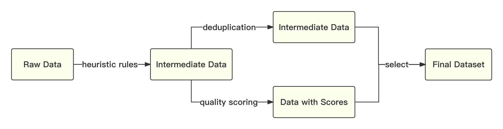
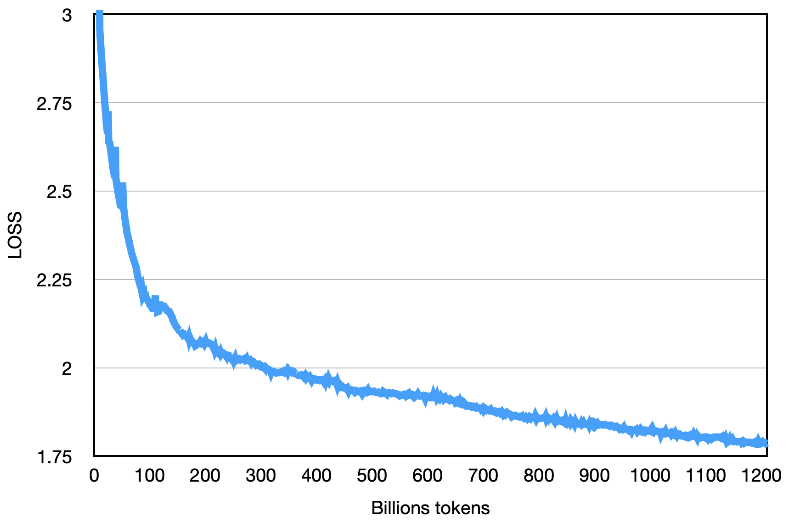

<div align="center">
      <h1> baichuan-7B </h1>
<p align="center" style="display: flex; flex-direction: row; justify-content: center; align-items: center">
      🤗 
      <a href="https://huggingface.co/baichuan-inc/baichuan-7B" target="_blank" style="margin-right: 15px; margin-left: 10px">Hugging Face</a> • 
        🤖
      <a href="https://modelscope.cn/organization/baichuan-inc" target="_blank" style="margin-left: 10px">ModelScope</a > •
        <a href="https://github.com/baichuan-inc/baichuan-7B/blob/main/media/wechat.jpeg?raw=true" target="_blank" rel="noopener noreferrer" style="display: inline-block; margin-left: 10px">
      <span style="color: blue;">Wechat</span>
    </a>
    </p>


[](https://github.com/baichuan-inc/baichuan-7B/blob/main/LICENSE)
<h4 align="center">
    <p>
        <b>English</b> |
        <a href="https://github.com/baichuan-inc/baichuan-7B/blob/main/README.md">中文</a>
    <p>
</h4>


</div>

# Introduction

baichuan-7B is an open-source, large-scale pre-trained language model developed by Baichuan Intelligent Technology. baichuan-7B is based on Transformer architecture, which contains 7 billion parameters and trained on approximately 1.2 trillion tokens. It supports both Chinese and English languages with a context window length of 4096. It has achieved the best performance among models of the same size on standard Chinese and English authoritative benchmarks (C-EVAL, MMLU, etc).

# Benchmark

## Chinese Benchmarks
### C-Eval
[C-Eval](https://cevalbenchmark.com/index.html) is a comprehensive Chinese language models evaluation dataset, covering 52 subjects and four levels of difficulty. We used the dev set from this dataset as the source for few-shot learning and conducted a 5-shot test on the test set.


Change OPENMODEL_PATH and CEVAL_DATA_PATH in evaluate_zh.py, corresponding to model's and C-Eval dataset's directories, then run:
```shell
shot=5  # few-shot
gpu=0  # GPUid
split=test  # test set
model_id=baichuan-7b   # model
task=ceval  # task name：ceval
echo gpu_idx-${gpu}-${model_id}_${task}_${split}_${shot}-shot
nohup python  evaluate_zh.py --gpu_idx ${gpu} --model_id ${model_id} --task ${task} --shot ${shot} --split ${split} --show_detail  > ${model_id}_${task}_${split}_${shot}-shot_record.txt 2>&1 &

```

### Result

| Model 5-shot                | Average | Avg(Hard) | STEM | Social Sciences | Humanities | Others |
|-----------------------------|---------|-----------|------|-----------------|------------|--------|
| GPT-4                       | 68.7    | 54.9      | 67.1 | 77.6            | 64.5       | 67.8   |
| ChatGPT                     | 54.4    | 41.4      | 52.9 | 61.8            | 50.9       | 53.6   |
| Claude-v1.3                 | 54.2    | 39.0      | 51.9 | 61.7            | 52.1       | 53.7   |
| Claude-instant-v1.0         | 45.9    | 35.5      | 43.1 | 53.8            | 44.2       | 45.4   |
| BLOOMZ-7B                   | 35.7    | 25.8      | 31.3 | 43.5            | 36.6       | 35.6   |
| ChatGLM-6B                  | 34.5    | 23.1      | 30.4 | 39.6            | 37.4       | 34.5   |
| Ziya-LLaMA-13B-pretrain     | 30.2    | 22.7      | 27.7 | 34.4            | 32.0       | 28.9   |
| moss-moon-003-base (16B)    | 27.4    | 24.5      | 27.0 | 29.1            | 27.2       | 26.9   |
| LLaMA-7B-hf                 | 27.1    | 25.9      | 27.1 | 26.8            | 27.9       | 26.3   |
| Falcon-7B                   | 25.8    | 24.3      | 25.8 | 26.0            | 25.8       | 25.6   |
| TigerBot-7B-base            | 25.7    | 27.0      | 27.3 | 24.7            | 23.4       | 26.1   |
| Aquila-7B<sup>*</sup>       | 25.5    | 25.2      | 25.6 | 24.6            | 25.2       | 26.6   |
| Open-LLaMA-v2-pretrain (7B) | 24.0    | 22.5      | 23.1 | 25.3            | 25.2       | 23.2   |
| BLOOM-7B                    | 22.8    | 20.2      | 21.8 | 23.3            | 23.9       | 23.3   |
| **baichuan-7B**             | 42.8    | 31.5      | 38.2 | 52.0            | 46.2       | 39.3   |


### Gaokao
[Gaokao](https://github.com/OpenLMLab/GAOKAO-Bench) is an evaluation dataset curated from questions used in Chinese College Entrance Examination, to evaluate the capabilities of large language models, assessing models' language ability and logical reasoning skills. We processed the dataset to only containing single-answer multiple choice questions, we conducted a 5-shot test on all models.

### Results

| Model            | Average |
|-------------------------|-----------------|
| BLOOMZ-7B               | 28.72           |
| LLaMA-7B                | 27.81           |
| BLOOM-7B                | 26.96           |
| TigerBot-7B-base        | 25.94           |
| Falcon-7B               | 23.98           |
| Ziya-LLaMA-13B-pretrain | 23.17           |
| ChatGLM-6B              | 21.41           |
| Open-LLaMA-v2-pretrain  | 21.41           |
| Aquila-7B<sup>*</sup>   | 24.39           |
| **baichuan-7B**         | **36.24**       |


### AGIEval
[AGIEval](https://github.com/microsoft/AGIEval) is a dataset aimed at evaluating models' general abilities in cognitive and problem-solving tasks.
we conducted a 5-shot test on all models.

### Result

| Model            | Average |
|-------------------------|-----------------|
| BLOOMZ-7B               | 30.27           |
| LLaMA-7B                | 28.17           |
| Ziya-LLaMA-13B-pretrain | 27.64           |
| Falcon-7B               | 27.18           |
| BLOOM-7B                | 26.55           |
| Aquila-7B<sup>*</sup>   | 25.58           |
| TigerBot-7B-base        | 25.19           |
| ChatGLM-6B              | 23.49           |
| Open-LLaMA-v2-pretrain  | 23.49           |
| **baichuan-7B**         | **34.44**       |

<sup>*</sup>The Aquila-7b are not implemented on Huggingface yet so we derived the model from (https://model.baai.ac.cn/model-detail/100098), which may have not identical to their official result.

## English Benchmarks
In addition to Chinese, we also tested the performance of models in English. [MMLU](https://arxiv.org/abs/2009.03300) is an English evaluation dataset that includes 57 multiple-choice tasks, covering elementary mathematics, American history, computer science, law, etc. The difficulty spans from high school level to expert level, making it a mainstream evaluation dataset for Large Language Models (LLMs).

We adopt the public implementation of (https://github.com/hendrycks/test) and the final result is shwon below：

### Results on MMLU

| Model                                  | Humanities | Social Sciences | STEM | Other | Average |
|----------------------------------------|-----------:|:---------------:|:----:|:-----:|:-------:|
| ChatGLM-6B<sup>0</sup>                 |       35.4 |      41.0       | 31.3 | 40.5  |  36.9   |
| BLOOMZ-7B<sup>0</sup>                  |       31.3 |      42.1       | 34.4 | 39.0  |  36.1   |
| mpt-7B<sup>1</sup>                     |          - |        -        |  -   |   -   |  35.6   |
| LLaMA-7B<sup>2</sup>                   |       34.0 |      38.3       | 30.5 | 38.1  |  35.1   |
| Falcon-7B<sup>1</sup>                  |          - |        -        |  -   |   -   |  35.0   |
| moss-moon-003-sft (16B)<sup>0</sup>    |       30.5 |      33.8       | 29.3 | 34.4  |  31.9   |
| BLOOM-7B<sup>0</sup>                   |       25.0 |      24.4       | 26.5 | 26.4  |  25.5   |
| moss-moon-003-base (16B)<sup>0</sup>   |       24.2 |      22.8       | 22.4 | 24.4  |  23.6   |
| **baichuan-7B<sup>0</sup>**            |   **38.4** |    **48.9**     | **35.6** | **48.1**  |  **42.3**   |

### Notes：
    0: Our implementation
    1: https://huggingface.co/spaces/HuggingFaceH4/open_llm_leaderboard
    2: https://paperswithcode.com/sota/multi-task-language-understanding-on-mmlu

### How to implement by yourself
```shell
git clone https://github.com/hendrycks/test
cd test
wget https://people.eecs.berkeley.edu/~hendrycks/data.tar
tar xf data
mkdir results
cp evaluate_mmlu.py .
python evaluation/evaluate_mmlu.py -m /path/to/baichuan-7b

```

Specifically, the result of 57 MMLU tasks is：
<p align="center">
    <br>
    
    <br>
</p>

And the comparison of 21 different subjects is：
<p align="center">
    <br>
    
    <br>
</p>

# Inference

```python
from transformers import AutoModelForCausalLM, AutoTokenizer

tokenizer = AutoTokenizer.from_pretrained("baichuan-inc/baichuan-7B", trust_remote_code=True)
model = AutoModelForCausalLM.from_pretrained("baichuan-inc/baichuan-7B", device_map="auto", trust_remote_code=True)
inputs = tokenizer('Hamlet->Shakespeare\nOne Hundred Years of Solitude->', return_tensors='pt')
inputs = inputs.to('cuda:0')
pred = model.generate(**inputs, max_new_tokens=64)
print(tokenizer.decode(pred.cpu()[0], skip_special_tokens=True))

```

# Data

* The original corpora includes open-source Chinese and English data, self-crawled Chinese internet data, and some high-quality knowledge-intensive data.
* Referring to related data work, frequency and quality are two dimensions that are considered important in the data processing stage. We apply heuristic rules and quality model scoring to filter the original dataset at both the paragraph and sentence levels. Employing the Locality-Sensitive Hashing (LSH) method on the full dataset, we perform de-duplication at both the paragraph and sentence levels.

The whole data processing process is shown below:
<p align="center">
    <br>
    
    <br>
</p>

* After continuous adjustments and multiple rounds of testing, we finally determined the best Chinese to English ratio that are optimized on downstream tasks.
* We used an automatic algorithm-based data sampling strategy to balance the weights of different data categories.

# Tokenization
We use the byte pair encoding (BPE) from SentencePiece as the tokenization algorithm, along with the following optimizations:

1. Most open-source models are primarily optimized for English, resulting in low efficiency for Chinese corpus. So we trained the tokenizer using 20 million multilingual corpora mainly composed of Chinese and English, significantly improving the compression rate for Chinese.
2. To improve the ability for mathmatics, we split all numbers into individual digits that is also adopted in LLaMA and Galactica, separately tokenizing each digit to avoid inconsistencies in numbers.
3. For rare words (such as emoji and special symbols), we fallback unknown characters to byte encoding of UTF-8, thus achieving full coverage of unknown words.
4. We analyzed the compression rate of different tokenizers on the corpus. As shown in the following table, our tokenizer significantly outperforms open-source models like LLaMA, Falcon, and others. Compared to other Chinese tokenizers with similar compression rates, it offers higher training and inference efficiency. 

| Model         | baichuan-7B | LLaMA | Falcon | mpt-7B | ChatGLM | moss-moon-003 |
|---------------|-------------|-------|--------|--------|---------|---------------|
| Compress Rate | 0.737       | 1.312 | 1.049  | 1.206  | 0.631   | 0.659         |
| Vocab Size    | 64,000      | 32,000 | 65,024 | 50,254  | 130,344 | 106,029     |

# Model Architecture
The overall model is based on the standard Transformer structure, and we have adopted a model design similar to that of LLaMA.
* Positional Embeddings: [rotary-embedding](https://arxiv.org/abs/2104.09864) is the widely used positional encoding method, with better extrapolation effects. Although the maximum length during training is 4096, the model can be well extrapolated to 5000 tokens in inference time, as shown in the following diagram:
   <p align="center">
    <br>
    
    <br>
     </p>
* Activation：SwiGLU, and the dimension of the feedforward-layer is set to 11,008
* Layer-Normalization: We use the Pre-Normalization method based on [RMSNorm](https://arxiv.org/abs/1910.07467)

## Training stability and Throughput
We made numerous modifications to the original LLaMA framework to improve throughput during training, including:

1. Operator optimization technology: We adopted more efficient operators, such as Flash-attention, NVIDIA apex's RMSNorm, etc.
2. Tensor partitioning technology: We partitioned some computational operators to reduce peak memory usage.
3. Mixed-precision technology: This accelerates the computational process without sacrificing model accuracy.
4. Training failure recovery technology: The training platform and the training framework were jointly optimized. By combining IaaS and PaaS, we can locate faults and recover tasks within minutes.
5. Communication optimization technology which includes:
   1. Topology-aware collective communication algorithms to avoid network congestion and improve communication efficiency.
   2. Adaptive setting of bucket size based on the number of cards to improve bandwidth utilization.
   3. Tuning the trigger timing of communication primitives based on the model and the cluster environment, thereby overlapping computation and communication.
   
By using these optimization techniques, we achieved a throughput of 182 TFLOPS for the 7B model on thousand A800 GPUs, with a peak GPU computing power utilization rate of up to 58.3%.

The final loss of the model is shown below：
<p align="center">
    <br>
    
    <br>
</p>


# Training
## Install requirements
```shell
pip install -r requirements.txt
```
## Prepare pre-training datasets
You should divide the training corpus into multiple UTF-8 text files evenly according to the multiple of the total rank number, and place them in the corpus directory (default is `data_dir`). Each rank processor will read different files in the corpus directory, load them all into memory, and then start the subsequent training process. The above is a simplified demonstration process. It is recommended that users adjust the data production logic according to their needs in formal training tasks.

## Download tokenizer
You can download our [tokenizer.model](https://huggingface.co/baichuan-inc/baichuan-7B/blob/main/tokenizer.model) from the Huggingface, and place them in the root director.
   
## Config DeepSpeed
This demo code uses the DeepSpeed framework for training. Users should modify `config/hostfile` according to the cluster conditions.

## Start training
```shell
scripts/train.sh
```


# Licences
The use of the source code in this repository is governed by the open source license [Apache 2.0](https://github.com/baichuan-inc/baichuan-7B/blob/main/LICENSE) .

The use of the baichuan-7B model weights, however, must follow the [《baichuan-7B 模型许可协议》](https://huggingface.co/baichuan-inc/baichuan-7B/resolve/main/baichuan-7B%20%E6%A8%A1%E5%9E%8B%E8%AE%B8%E5%8F%AF%E5%8D%8F%E8%AE%AE.pdf) .

# Third-Party Resources

1. [LLaMA Efficient Tuning](https://github.com/hiyouga/LLaMA-Efficient-Tuning) supports baichuan-7B to use Qlora for finetuning, supports RLHF, and supports WebDemo. For models that have gone through sft, see [hiyouga/baichuan-7b-sft](https://huggingface.co/hiyouga/baichuan-7b-sft).
2. [fireballoon/baichuan-vicuna-chinese-7b](https://huggingface.co/fireballoon/baichuan-vicuna-chinese-7b) uses ShareGPT, ShareGPT-ZH, COT & COT-ZH, Leetcode, dummy, and other Chinese and English data for finetuning. For training code, refer to FastChat.
3. [fireballoon/baichuan-vicuna-7b](https://huggingface.co/fireballoon/baichuan-vicuna-7b) uses ShareGPT, COT, and Leetcode, among other data, for mixed finetuning. For training code, refer to FastChat.
4. [Efficient-Tuning-LLMs](https://github.com/jianzhnie/Efficient-Tuning-LLMs) supports baichuan-7B to use Qlora for finetuning and 4bit inference.
5. [fastllm](https://github.com/ztxz16/fastllm) is a large model library implemented purely in C++, with no third-party dependencies, and supports baichuan-7B to run on mobile devices.
6. [TheBloke/baichuan-7B-GPTQ](https://huggingface.co/TheBloke/baichuan-7B-GPTQ) is for the 4bit quantization of baichuan-7B's GPTQ.

# Star History
[](https://star-history.com/#baichuan-inc/baichuan-7B&Date)
